<div align="center">

<!-- ═══════════════════════════════════════════ BANNER ═══════════════════════════════════════════ -->



<br/>

<!-- ════════════════════════════════════════ TYPING ANIMATION ════════════════════════════════════════ -->

<a href="https://github.com/Mohamed-ehab-mohy">
  
</a>

<br/>

<!-- ═════════════════════════════════════════ BADGES ROW ═════════════════════════════════════════ -->

<a href="https://www.linkedin.com/in/mohamed-ehab-mohy">
  
</a>
<a href="mailto:mohamedehab92005@gmail.com">
  
</a>
<a href="https://github.com/Mohamed-ehab-mohy?tab=repositories">
  
</a>
<a href="https://komarev.com/ghpvc/?username=Mohamed-ehab-mohy&label=Profile+Views&color=0d1117&style=for-the-badge">
  
</a>

<br/>

<!-- ═════════════════════════════════════════ NAVIGATION ═════════════════════════════════════════ -->


<div align="center">

[**About**](#-about-me) · [**Tech Stack**](#️-tech-stack) · [**Skills**](#-backend--architecture-skills) · [**Experience**](#-experience) · [**Projects**](#-featured-projects) · [**Certifications**](#-certifications) · [**Stats**](#-github-analytics) · [**Contact**](#-lets-connect)

</div>


<br/>

<!-- ═════════════════════════════════════════ ABOUT ME ═════════════════════════════════════════ -->

<div align="center">

## 👤 About Me

</div>

<table>
<tr>
<td width="100%" valign="middle">

```csharp
public class Developer
{
    public string Name         => "Mohamed Ehab Mohy El-Din";
    public string Role         => ".NET Backend Developer";
    public string Location     => "Alexandria, Egypt 🇪🇬";

    public string[] Focus      => { "Building production-grade backend systems with Clean Architecture" };
    public string[] Stack      => { "ASP.NET Core", "EF Core", "SQL Server", "PostgreSQL", "Docker" };
    public string[] Learning   => { "Multi-Tenant SaaS", "CQRS", "Redis Caching", "Microservices" };
    public string[] Goals      => { "Junior / Mid-Level .NET Backend Developer in a strong engineering team" };

    public bool OpenToWork     => true;
    public bool CoffeePowered  => true;
}
```

</td>
</tr>
</table>

<div align="center">

> **Architecture is a series of trade-offs — my job is to make the right ones explicit, testable, and documented.**

</div>

- 🏢 **.NET Backend Developer** at **Enexabit** — building a Multi-Tenant SaaS platform with ASP.NET Core, SQL Server & PostgreSQL
- 📚 Sharpening skills in **Multi-Tenant Architecture**, **CQRS**, **Redis caching**, and **real-time systems**
- 🎯 Actively seeking a **Junior / Mid-Level .NET Backend Developer** role
- 🌍 Selected delegate at **KnowTalks** — a regional knowledge-exchange forum by the *Mohammed Bin Rashid Al Maktoum Knowledge Foundation & UNDP* (April 2025)
- 🗣️ **Arabic** (Native) · **English** (B2 — Professional Working Proficiency)
- ✍️ Writing about **Design Patterns**, backend engineering, and the .NET ecosystem on [LinkedIn](https://www.linkedin.com/in/mohamed-ehab-mohy)


<br/>

<!-- ═════════════════════════════════════════ TECH STACK ═════════════════════════════════════════ -->

<div align="center">

## 🧰 Tech Stack


</div>

<br/>

<table>
<tr>
<td width="25%" align="center">

**Languages & Frameworks**
<br/><br/>


</td>
<td width="25%" align="center">

**Databases**
<br/><br/>


</td>
<td width="25%" align="center">

**DevOps & Tools**
<br/><br/>


</td>
<td width="25%" align="center">

**IDEs & Editors**
<br/><br/>


</td>
</tr>
</table>

<div align="center">

| Layer | Technologies |
|:---:|---|
| **Language** |  |
| **Frameworks** |    |
| **Databases** |    |
| **Testing** |   |
| **DevOps** |    |
| **Tools** |    |
| **Real-Time** |   |

</div>


<br/>

<!-- ═════════════════════════════════════════ SKILLS ═════════════════════════════════════════ -->

<div align="center">

## 🏗️ Backend & Architecture Skills

</div>

<table>
<tr>
<td width="50%" valign="top">

#### 🔷 .NET Ecosystem
- C#, ASP.NET Core MVC, ASP.NET Core Web API
- Entity Framework Core (EF Core), LINQ
- Generics & Collections
- Dependency Injection (Autofac / built-in)
- RESTful APIs, CRUD, JSON
- JWT Auth & ASP.NET Core Identity

#### 🔷 Architecture & Design
- Clean Architecture (N-Tier)
- Multi-Tenant SaaS Architecture
- Microservices Architecture
- CQRS Pattern
- SOLID Principles & OOP
- GoF Patterns — *Factory, Strategy, Decorator, Singleton, Observer*

</td>
<td width="50%" valign="top">

#### 🔷 Enterprise & Middleware
- Redis Caching
- SignalR (real-time hubs)
- Background / Hosted Services (Quartz.NET)

#### 🔷 Database Systems
- SQL Server, T-SQL, PostgreSQL
- Relational design & Normalization (3NF)
- Triggers, Indexes, Stored Procedures

#### 🔷 Testing & Quality
- Unit Testing & Integration Testing
- Architecture Testing (NetArchTest)
- xUnit + Mocking Frameworks

#### 🔷 DevOps & Tooling
- Docker & Docker Compose
- Git, GitHub, .NET CLI
- Postman, CI/CD Pipelines

</td>
</tr>
</table>


<br/>

<!-- ═════════════════════════════════════════ EXPERIENCE ═════════════════════════════════════════ -->

<div align="center">

## 💼 Experience

</div>

<table>
<tr>
<td width="100%">

### .NET Backend Developer — **Enexabit**
📅 *May 2026 — Present* &nbsp;·&nbsp; 🕒 *Part-time* &nbsp;·&nbsp; 🏙️ *Hybrid, Alexandria, Egypt*

- Contributed to a **Multi-Tenant SaaS architecture**, supporting strict data isolation and scalability across multiple client tenants.
- Developed **RESTful APIs** using ASP.NET Core within a tenant-aware backend architecture.
- Collaborated on **database design and schema implementation** using SQL Server and PostgreSQL.
- Wrote clean C# code following **OOP principles** and **GoF design patterns**.
- Participated in **debugging and testing** backend services, supporting integration with third-party infrastructure.

</td>
</tr>
</table>


<br/>

<!-- ═════════════════════════════════════════ PROJECTS ═════════════════════════════════════════ -->

<div align="center">

## 🚀 Featured Projects

</div>

<table>
<tr>
<td width="100%">

### 💬 ChatApp — *Real-Time Chat Platform*

<div align="center">


</div>

> A full-stack real-time messaging platform built with .NET 10 Minimal API, SignalR, PostgreSQL, and a React 19 frontend with PWA push notifications.

- **Real-Time Engine:** Built a **SignalR WebSocket hub** (`/hub/chat`) with automatic reconnection, instant bidirectional messaging, and paginated message history via REST.
- **Authentication & Security:** Implemented **ASP.NET Core Identity + JWT** with HttpOnly refresh token rotation (XSS-safe), rate limiting, CSP headers, HTML sanitization, and CORS whitelist policy.
- **PWA Push Notifications:** Integrated **Web Push API** with VAPID authentication — notifications broadcast to all users except the sender, with automatic expired-subscription cleanup.
- **Cloud-Native Deployment:** Containerized with **Docker**, deployed on **Railway.app** (backend) and **Cloudflare Pages** (frontend) with OpenAPI 3.1 + Scalar interactive docs.
- **Architecture:** Clean separation between API endpoints, SignalR hubs, services, and data layer — fully versioned (`/api/v1/`) with FluentValidation input validation.

<div align="center">

<a href="https://github.com/Mohamed-ehab-mohy/ChatApp">
  
</a>

</div>

</td>
</tr>
<tr>
<td width="100%">

### 🏋️ Gym Management System — *SaaS Enterprise Web Application*

<div align="center">


</div>

> A decoupled, multi-tenant SaaS gym-management platform built around a strict 4-layer Clean Architecture.

- **Architectural Design:** Engineered a decoupled **4-layer Clean Architecture** (Presentation, Business Logic, Data Access, Domain) using **Autofac Modules** for strict separation of concerns and dependency inversion.
- **Database & Auditing:** Built an optimized PostgreSQL data layer with fluent configurations and custom **EF Core DbContext Interceptors** to automate soft-delete querying and enforce real-time JSON-style audit logging.
- **Real-Time & Background Services:** Implemented asynchronous **Hosted Services & Scheduled Jobs** for automated purging and membership-renewal alerts, streamed live via a **SignalR NotificationHub**.
- **Testing & Quality:** Built an exhaustive **xUnit** test suite paired with **NetArchTest** to statically enforce assembly dependency boundaries.
- **Deployment:** Fully containerized with **Docker**, with relational check constraints enforcing data integrity at the database tier.

<div align="center">

<a href="https://github.com/Mohamed-ehab-mohy/GymManagementSystem">
  
</a>

</div>

</td>
</tr>
<tr>
<td width="100%">

### 🏫 School Portal — *Docker-Containerized Microservices Application*

<div align="center">


</div>

> A distributed school-management system split into autonomous, independently deployable microservices.

- **Microservices Architecture:** Split the application into autonomous services (`students-mvc`, `grades-mvc`), decoupling core domains for stronger operational boundaries and scalability.
- **Inter-Service Communication:** Built dedicated **HTTP REST Clients** (`StudentsServiceClient`) with asynchronous pipelines for cross-boundary DTO transfer.
- **Data Isolation:** Enforced strict data sovereignty with **separate SQL Server databases** per service, each with its own EF Core `DbContext` and migrations.
- **Container Orchestration:** Authored multi-stage Dockerfiles per service and orchestrated networks, volumes, and environments via **Docker Compose**.

<div align="center">

<a href="https://github.com/Mohamed-ehab-mohy/School-Portal-Docker-Microservices">
  
</a>

</div>

</td>
</tr>
<tr>
<td width="100%">

### 📚 Library Management System — *Production-Ready, Test-Driven Build*

<div align="center">


</div>

> A production-oriented library management system built with a strong focus on automated test coverage.

<div align="center">

<a href="https://github.com/Mohamed-ehab-mohy/LibraryManagement-ProductionReady-Testing">
  
</a>

</div>

</td>
</tr>
</table>

<div align="center">

<a href="https://github.com/Mohamed-ehab-mohy?tab=repositories">
  
</a>

</div>


<br/>

<!-- ═════════════════════════════════════════ CERTIFICATIONS ═════════════════════════════════════════ -->

<div align="center">

## 🎓 Certifications

</div>

<table>
<tr>
<td width="50%" valign="top">

#### 🏅 .NET Backend Development Diploma
*Route Academy — Nov 2025 to Jun 2026*
<br/>
Structured enterprise backend engineering program covering SQL Server, C#, OOP, Advanced C#, LINQ, Generics, Collections, ASP.NET Core MVC, EF Core, Web API Development, and Enterprise Security.

#### 🏅 Meta Back-End Developer Professional Certificate
*Meta via Coursera — Jul 2025*
<br/>
9-course specialization covering Back-End Architecture, RESTful APIs, Django, Database Optimization, Git, Full-Stack Integration, and Coding Interview Preparation.

</td>
<td width="50%" valign="top">

#### 🏅 IBM Full Stack Software Developer Professional Certificate
*IBM Skills Network via Coursera — Oct 2024*
<br/>
14-course program covering Cloud-Native Development, React, Node.js, Python, Django, SQL & NoSQL, Docker, Kubernetes, Microservices, and CI/CD.

#### 🏅 Google IT Support Professional Certificate
*Google via Coursera — Oct 2024*
<br/>
5-course foundational program covering Network Protocols, Operating Systems, Linux Administration, IT Infrastructure Automation, and Network Security.

</td>
</tr>
</table>


<br/>

<!-- ═════════════════════════════════════════ GITHUB STATS ═════════════════════════════════════════ -->

<div align="center">

## 📊 GitHub Analytics

</div>

<div align="center">


</div>

<div align="center">


</div>

<div align="center">


</div>

<br/>

<details>
<summary><b>🏆 GitHub Trophies</b></summary>
<br/>
<div align="center">
  
</div>
</details>

<details>
<summary><b>🗂️ Profile Summary</b></summary>
<br/>
<div align="center">
  
  
</div>
</details>

<details open>
<summary><b>🐍 Contribution Snake</b></summary>
<br/>
<div align="center">
  <picture>
    <source media="(prefers-color-scheme: dark)" srcset="https://raw.githubusercontent.com/Mohamed-ehab-mohy/Mohamed-ehab-mohy/output/assets/snake-dark.svg" />
    <source media="(prefers-color-scheme: light)" srcset="https://raw.githubusercontent.com/Mohamed-ehab-mohy/Mohamed-ehab-mohy/output/assets/snake.svg" />
    
  </picture>
</div>
</details>


<br/>

<!-- ═════════════════════════════════════════ QUOTE ═════════════════════════════════════════ -->

<div align="center">


</div>


<br/>

<!-- ═════════════════════════════════════════ CONTACT ═════════════════════════════════════════ -->

<div align="center">

## 📬 Let's Connect

<br/>

I'm actively open to **Junior / Mid-Level .NET Backend Developer** opportunities — remote, hybrid, or on-site.
If you're hiring or just want to talk backend engineering, reach out below.

<br/>

<a href="https://www.linkedin.com/in/mohamed-ehab-mohy">
  
</a>
<a href="mailto:mohamedehab92005@gmail.com">
  
</a>
<a href="https://github.com/Mohamed-ehab-mohy">
  
</a>

<br/>


<br/>

<sub>Built with C#, ASP.NET Core, and a lot of coffee ☕ — thanks for stopping by!</sub>
<br/>
<sub>© 2026 Mohamed Ehab Mohy El-Din</sub>

</div>
