<div align="center">



<br/>

<a href="https://github.com/Mohamed-ehab-mohy">
  
</a>

<br/>

<a href="https://www.linkedin.com/in/mohamed-ehab-mohy">
  
</a>
<a href="mailto:mohamedehab92005@gmail.com">
  
</a>
<a href="https://github.com/Mohamed-ehab-mohy">
  
</a>


</div>

<div align="center">

**[About](#-about-me)** &nbsp;·&nbsp;
**[Tech Stack](#-tech-stack)** &nbsp;·&nbsp;
**[Skills](#-backend--architecture-skills)** &nbsp;·&nbsp;
**[Experience](#-experience)** &nbsp;·&nbsp;
**[Projects](#-featured-projects)** &nbsp;·&nbsp;
**[Certifications](#-certifications--continuous-learning)** &nbsp;·&nbsp;
**[GitHub Stats](#-github-analytics)** &nbsp;·&nbsp;
**[Contact](#-lets-connect)**

</div>

<br/>

## 👤 About Me

```csharp
public class Developer
{
    public string Name        => "Mohamed Ehab Mohy El-Din";
    public string Role        => ".NET Backend Developer";
    public string Location    => "Alexandria, Egypt";
    public string Education   => "B.Sc. Business Administration, Alexandria University (Final Year, Expected 2027)";

    public string[] CurrentWork    => { "Building a Multi-Tenant SaaS backend @ Enexabit (ASP.NET Core, SQL Server / PostgreSQL)" };
    public string[] CurrentLearning => { "Deepening Multi-Tenant SaaS Architecture, CQRS and Redis caching strategies" };
    public string[] Goals          => { "Landing a Junior/Mid-Level .NET Backend Developer role in a strong engineering team" };

    public bool OpenToWork => true;
}
```

I'm a **.NET Backend Developer** with hands-on experience in **ASP.NET Core**, **Entity Framework Core**, and **SQL Server**, currently working part-time while building production-grade systems around **Clean Architecture**, **Docker**, and modern software engineering practices. I care about writing code that is testable, decoupled, and built to scale — not just code that "works."

- 🏢 Currently working as a **.NET Backend Developer** at **Enexabit**, contributing to a Multi-Tenant SaaS platform.
- 📚 Currently sharpening my skills in **Multi-Tenant Architecture**, **CQRS**, and **caching/real-time systems (Redis, SignalR)**.
- 🎯 Actively seeking a **Junior / Mid-Level .NET Backend Developer** role where I can grow inside a strong engineering culture.
- 🧠 **Philosophy:** *Architecture is a series of trade-offs — my job is to make the right ones explicit, testable, and documented.*
- ✍️ I write about **Design Patterns**, backend engineering, and the .NET ecosystem on LinkedIn.
- 🌍 Selected delegate at **KnowTalks**, a regional knowledge-exchange forum by the *Mohammed Bin Rashid Al Maktoum Knowledge Foundation & UNDP* (April 2025).
- 🗣️ **Languages:** Arabic (Native) · English (B2 — Professional Working Proficiency)


## 🧰 Tech Stack

<div align="center">


</div>

<br/>

<div align="center">

| Layer | Technologies |
|---|---|
| **Language** |  |
| **Frameworks** |    |
| **Databases** |    |
| **Testing** |   |
| **DevOps** |     |
| **Tools** |    |
| **Real-Time & Jobs** |   |

</div>


## 🏗️ Backend & Architecture Skills

<table>
<tr>
<td width="50%" valign="top">

### 🔷 .NET Ecosystem
- C#, ASP.NET Core MVC, ASP.NET Core Web API
- Entity Framework Core (EF Core), LINQ
- Generics & Collections
- Dependency Injection (Autofac / built-in)
- RESTful APIs & CRUD operations, JSON
- Authentication & Authorization (JWT, ASP.NET Core Identity)

### 🔷 Architecture & Design
- Clean Architecture (N-Tier)
- Multi-Tenant SaaS Architecture
- Microservices Architecture
- CQRS Pattern
- SOLID Principles & OOP
- GoF Design Patterns — *Factory, Strategy, Decorator, Singleton, Observer*

</td>
<td width="50%" valign="top">

### 🔷 Enterprise & Middleware
- Redis Caching
- SignalR (real-time hubs)
- Background / Hosted Services (Quartz.NET)

### 🔷 Database Systems
- SQL Server, T-SQL, PostgreSQL
- Relational database design & Normalization (3NF)
- Database triggers, non-clustered indexes
- Stored procedures, NoSQL fundamentals

### 🔷 Testing & Quality Assurance
- Unit Testing & Integration Testing
- Architecture Testing (NetArchTest)
- xUnit Framework
- Mocking Frameworks

### 🔷 DevOps & Tooling
- Docker & Docker Compose
- Git, GitHub, Visual Studio, .NET CLI
- Postman, CI/CD Pipelines
- Cloud-Native Development

</td>
</tr>
</table>


## 💼 Experience

<table>
<tr>
<td width="100%">

### .NET Backend Developer — **Enexabit**
📅 *May 2026 — Present*  &nbsp;|&nbsp; 🕒 *Part-time*  &nbsp;|&nbsp; 🏙️ *Hybrid, Alexandria, Egypt*

- Contributed to a **Multi-Tenant SaaS architecture**, supporting strict data isolation and scalability across multiple client tenants.
- Developed **RESTful APIs** using ASP.NET Core within a tenant-aware backend architecture.
- Collaborated on **database design and schema implementation** using SQL Server and PostgreSQL.
- Wrote clean C# code following **OOP principles** and **GoF design patterns**.
- Participated in **debugging and testing** backend services, supporting integration with third-party infrastructure.

</td>
</tr>
</table>


## 🚀 Featured Projects

### 🏋️ Gym Management System — *SaaS Enterprise Web Application*

         

> A decoupled, multi-tenant SaaS gym-management platform built around a strict 4-layer Clean Architecture.

- **Architectural Design:** Engineered a decoupled **4-layer Clean Architecture** (Presentation, Business Logic, Data Access, Domain) using **Autofac Modules** for strict separation of concerns and dependency inversion.
- **Database & Auditing:** Built an optimized PostgreSQL data layer with fluent configurations and custom **EF Core DbContext Interceptors** to automate soft-delete querying and enforce real-time JSON-style audit logging.
- **Real-Time & Background Services:** Implemented asynchronous **Hosted Services & Scheduled Jobs** for automated purging and membership-renewal alerts, streamed live via a **SignalR NotificationHub**.
- **Testing & Quality:** Built an exhaustive **xUnit** test suite paired with **NetArchTest** to statically enforce assembly dependency boundaries.
- **Deployment:** Fully containerized with **Docker**, with relational check constraints enforcing data integrity at the database tier.

<div align="center">
  
</div>

<br/>

### 🏫 School Portal — *Docker-Containerized Microservices Application*

       

> A distributed school-management system split into autonomous, independently deployable microservices.

- **Microservices Architecture:** Split the application into autonomous services (`students-mvc`, `grades-mvc`), decoupling core domains for stronger operational boundaries and scalability.
- **Inter-Service Communication:** Built dedicated **HTTP REST Clients** (`StudentsServiceClient`) with asynchronous pipelines for cross-boundary DTO transfer.
- **Data Isolation:** Enforced strict data sovereignty with **separate SQL Server databases** per service, each with its own EF Core `DbContext` and migrations.
- **Container Orchestration:** Authored multi-stage Dockerfiles per service and orchestrated networks, volumes, and environments via **Docker Compose**.

<div align="center">
  
</div>

<br/>

### 📚 Library Management System — *Production-Ready, Test-Driven Build*

   

> A production-oriented library management system built with a strong focus on automated test coverage.

<div align="center">
  
</div>

<div align="center">
  <sub>📌 <b>Note:</b> this card pulls live from the repo itself — if it's private or renamed, update the <code>repo=</code> parameter above.</sub>
</div>

<br/>

<div align="center">
  <a href="https://github.com/Mohamed-ehab-mohy?tab=repositories">
    
  </a>
</div>


## 🎓 Certifications & Continuous Learning

<table>
<tr>
<td width="50%" valign="top">

**.NET Backend Development Diploma**
*Route Academy — Nov 2025 to Jun 2026*
Structured enterprise backend engineering program covering SQL Server, C#, OOP, Advanced C#, LINQ, Generics, Collections, ASP.NET Core MVC, EF Core, Web API Development, and Enterprise Security.

**Meta Back-End Developer Professional Certificate**
*Meta via Coursera — Jul 2025*
9-course specialization covering Back-End Architecture, RESTful APIs, Django, Database Optimization, Git, Full-Stack Integration, and Coding Interview Preparation.

</td>
<td width="50%" valign="top">

**IBM Full Stack Software Developer Professional Certificate**
*IBM Skills Network via Coursera — Oct 2024*
14-course program covering Cloud-Native Development, HTML5/CSS3/JavaScript, React, Node.js, Python, Django, SQL & NoSQL, Docker, Kubernetes, Microservices, and CI/CD.

**Google IT Support Professional Certificate**
*Google via Coursera — Oct 2024*
5-course foundational program covering Network Protocols, Operating Systems, Linux Administration, IT Infrastructure Automation, and Network Security.

</td>
</tr>
</table>


## 📊 GitHub Analytics

<div align="center">


</div>

<details>
<summary><b>🏆 GitHub Trophies</b></summary>
<br/>
<div align="center">
  
</div>
</details>

<details>
<summary><b>🗂️ Profile Summary Card</b></summary>
<br/>
<div align="center">
  
  
</div>
</details>

<details open>
<summary><b>🐍 Contribution Snake</b></summary>
<br/>
<div align="center">
  <picture>
    <source media="(prefers-color-scheme: dark)" srcset="https://raw.githubusercontent.com/Mohamed-ehab-mohy/Mohamed-ehab-mohy/output/assets/snake-dark.svg" />
    <source media="(prefers-color-scheme: light)" srcset="https://raw.githubusercontent.com/Mohamed-ehab-mohy/Mohamed-ehab-mohy/output/assets/snake.svg" />
    
  </picture>
  <sub>Generated automatically every day at 00:00 UTC by <code>.github/workflows/snake.yml</code> — see <a href="./SETUP.md">SETUP.md</a> to activate it.</sub>
</div>
</details>


<div align="center">
  
</div>


## 📬 Let's Connect

<div align="center">

I'm actively open to **Junior / Mid-Level .NET Backend Developer** opportunities — remote, hybrid, or on-site.
If you're hiring or just want to talk backend engineering, reach out below.

<a href="https://www.linkedin.com/in/mohamed-ehab-mohy">
  
</a>
<a href="mailto:mohamedehab92005@gmail.com">
  
</a>
<a href="https://github.com/Mohamed-ehab-mohy">
  
</a>

</div>

<br/>


<div align="center">
  <sub>Built with C#, ASP.NET Core, and a lot of coffee ☕ — thanks for stopping by!</sub>
  <br/>
  <sub>© 2026 Mohamed Ehab Mohy El-Din</sub>
</div>
