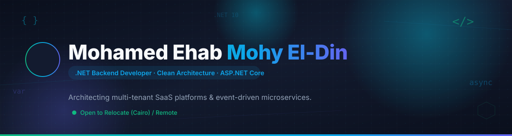

<div align="center">

<!-- ═══════════════════════════════════════════ BANNER ═══════════════════════════════════════════ -->



<br/>

<!-- ════════════════════════════════════════ TYPING ANIMATION ════════════════════════════════════════ -->

<a href="https://github.com/Mohamed-ehab-mohy">
  
</a>

<br/>

<!-- ═════════════════════════════════════════ BADGES ROW ═════════════════════════════════════════ -->

<a href="https://www.linkedin.com/in/mohamed-ehab-mohy">
  
</a>
<a href="mailto:mohamedehab92005@gmail.com">
  
</a>
<a href="https://github.com/Mohamed-ehab-mohy?tab=repositories">
  
</a>
<a href="https://komarev.com/ghpvc/?username=Mohamed-ehab-mohy&label=Profile+Views&color=0a0f1c&style=for-the-badge">
  
</a>

<br/>

<!-- ═════════════════════════════════════════ NAVIGATION ═════════════════════════════════════════ -->


<div align="center">

[**About**](#-about-me) · [**Tech Stack**](#️-tech-stack) · [**Skills**](#-backend--architecture-skills) · [**Experience**](#-experience) · [**Projects**](#-featured-projects) · [**Certifications**](#-certifications) · [**Stats**](#-github-analytics) · [**Contact**](#-lets-connect)

</div>


<br/>

<!-- ═════════════════════════════════════════ ABOUT ME ═════════════════════════════════════════ -->

<div align="center">

## 👤 About Me

</div>

<table>
<tr>
<td width="100%" valign="middle">

```csharp
public class Developer
{
    public string Name         => "Mohamed Ehab Mohy El-Din";
    public string Role         => ".NET Backend Developer";
    public string Location     => "Alexandria, Egypt 🇪🇬 (Open to Relocate - Cairo)";

    public string[] Focus      => { "Architecting multi-tenant SaaS, event-driven microservices, high-throughput APIs" };
    public string[] Stack      => { "C# 13", "ASP.NET Core 10", "PostgreSQL", "Redis", "RabbitMQ", "Docker", "Kubernetes" };
    public string[] Learning   => { "Saga Pattern", "CQRS", "Chaos Engineering", "Stripe Integrations" };
    public string[] Goals      => { "Building resilient, well-tested, production-ready systems" };

    public bool OpenToWork     => true;
}
```

</td>
</tr>
</table>

<div align="center">

> **Architecture is a series of trade-offs — my job is to make the right ones explicit, testable, and documented.**

</div>

- 🏢 **.NET Backend Developer** at **Enexabit** — building a Multi-Tenant SaaS platform ensuring strict data isolation
- 👨‍🏫 **Instructor** at **eYouth** — delivering programming training for the Digital Egypt Cubs Initiative (DECI)
- 🎯 Proven experience in **Clean Architecture, DDD, CQRS, and Kubernetes-based deployments**
- 🌍 Selected delegate at **KnowTalks** — a regional knowledge-exchange forum
- 🗣️ **Arabic** (Native) · **English** (B2 — Professional Working Proficiency)
- ✍️ Connect with me on [LinkedIn](https://www.linkedin.com/in/mohamed-ehab-mohy)


<br/>

<!-- ═════════════════════════════════════════ TECH STACK ═════════════════════════════════════════ -->

<div align="center">

## 🧰 Tech Stack


</div>

<br/>

<table>
<tr>
<td width="25%" align="center">

**Languages & Frameworks**
<br/><br/>


</td>
<td width="25%" align="center">

**Databases**
<br/><br/>


</td>
<td width="25%" align="center">

**DevOps & Tools**
<br/><br/>


</td>
<td width="25%" align="center">

**IDEs & Editors**
<br/><br/>


</td>
</tr>
</table>

<div align="center">

| Layer | Technologies |
|:---:|---|
| **Language** |   |
| **Frameworks** |    |
| **Databases** |     |
| **Messaging** |    |
| **Testing** |    |
| **DevOps** |    |
| **Observability**|    |

</div>


<br/>

<!-- ═════════════════════════════════════════ SKILLS ═════════════════════════════════════════ -->

<div align="center">

## 🏗️ Backend & Architecture Skills

</div>

<table>
<tr>
<td width="50%" valign="top">

#### 🔷 .NET Ecosystem
- ASP.NET Core 10 (MVC, Web API, Minimal API)
- Entity Framework Core, Dapper, MediatR, LINQ
- Generics & Collections
- Dependency Injection (Autofac / built-in)
- REST, GraphQL, gRPC APIs
- JWT (RS256), OAuth 2.0 (PKCE), ASP.NET Core Identity

#### 🔷 Architecture & Design
- Clean Architecture, Multi-Tenant SaaS
- Microservices, Event-Driven Architecture
- Domain-Driven Design (DDD), CQRS
- Saga Pattern, Transactional Outbox
- SOLID, OOP, GoF Design Patterns
- Optimistic/Pessimistic Concurrency

</td>
<td width="50%" valign="top">

#### 🔷 Enterprise & Middleware
- RabbitMQ (MassTransit)
- Redis Caching, Elasticsearch
- SignalR (real-time hubs), Quartz.NET
- Resilience: Circuit Breaker, Idempotency

#### 🔷 Database Systems
- SQL Server, PostgreSQL, T-SQL, NoSQL
- Database Design & Normalization

#### 🔷 Testing & Quality
- xUnit, Unit & Integration Testing
- k6 Load Testing, Chaos Engineering
- Architecture Testing (NetArchTest), Mocking

#### 🔷 DevOps & Tooling
- Docker, Docker Compose, Kubernetes
- GitHub Actions, Argo Rollouts, Traefik, CI/CD

</td>
</tr>
</table>


<br/>

<!-- ═════════════════════════════════════════ EXPERIENCE ═════════════════════════════════════════ -->

<div align="center">

## 💼 Experience

</div>

<table>
<tr>
<td width="100%">

### .NET Backend Developer — **Enexabit**
📅 *May 2026 — Present* &nbsp;·&nbsp; 🕒 *Part-time* &nbsp;·&nbsp; 🏙️ *Remote/Hybrid, Alexandria, Egypt*

- Built RESTful APIs within a **multi-tenant SaaS architecture**, ensuring strict data isolation and scalability across client tenants.
- Collaborated on **database design and schema implementation** using SQL Server and PostgreSQL.
- Wrote clean, maintainable C# code following **OOP principles** and **GoF design patterns**.
- Debugged and tested backend services, including integration with third-party infrastructure.

</td>
</tr>
<tr>
<td width="100%">

### Instructor — **eYouth**
📅 *Aug 2026 — Present* &nbsp;·&nbsp; 🕒 *Part-time* &nbsp;·&nbsp; 🏙️ *On-site, Alexandria, Egypt*

- Delivered programming and technology training to students as part of the **Digital Egypt Cubs Initiative (DECI)** in collaboration with MCIT.
- Guided students through practical coding activities and helped them understand programming concepts.
- Created an engaging learning environment and encouraged students to develop problem-solving skills.

</td>
</tr>
</table>


<br/>

<!-- ═════════════════════════════════════════ PROJECTS ═════════════════════════════════════════ -->

<div align="center">

## 🚀 Featured Projects

</div>

<table>
<tr>
<td width="100%">

### ★ E-Commerce Enterprise Backend Architecture
<div align="center">


</div>

> A multi-tenant SaaS e-commerce backend serving 22+ feature modules (Catalog, Checkout, Payments, Loyalty, etc.) using Clean Architecture, DDD, and CQRS.

- **Architected** a multi-tenant backend using CQRS with MediatR across 300+ command/query handlers.
- **Built an order placement saga** with idempotency keys, capability tokens, SELECT FOR UPDATE payment locking, and atomic coupon redemption.
- **Integrated Stripe payments** with HMAC webhook signature verification and circuit breaker fallback.
- **Designed multi-warehouse inventory** management with optimistic concurrency and backorder handling.
- **Implemented OAuth 2.0** with token family tracking and deployed on Kubernetes with Argo Rollouts and HPA.
- **Delivered a full quality pipeline** with 130+ unit tests, k6 load testing, and chaos engineering tests wired into CI/CD.

<div align="center">
<a href="https://github.com/Mohamed-ehab-mohy/ECommerce">
  
</a>
</div>

</td>
</tr>

<tr>
<td width="100%">

### 💬 ChatApp — *Real-Time Chat Platform*

<div align="center">


</div>

> A full-stack real-time messaging platform built with .NET 10 Minimal API, SignalR, PostgreSQL, and JWT Authentication.

- Built a **real-time chat backend** with a SignalR WebSocket hub and HttpOnly rotating refresh tokens.
- Implemented **Web Push (VAPID)** notifications, HTML sanitization, rate limiting, and CSP headers.
- Documented the API with **OpenAPI 3.1 and Scalar**, deployed via Docker to Railway with a live instance.

<div align="center">
<a href="https://github.com/Mohamed-ehab-mohy/ChatApp">
  
</a>
</div>

</td>
</tr>

<tr>
<td width="100%">

### 🏋️ Gym Management System — *SaaS Enterprise Web App*

<div align="center">


</div>

> A decoupled, multi-tenant SaaS gym-management platform built around a strict 4-layer Clean Architecture.

- Engineered a 4-layer **Clean Architecture** with Autofac modules.
- Built **EF Core interceptors** for automated soft-delete and audit logging.
- Enforced architectural boundaries with **NetArchTest** and covered core logic with xUnit integration tests.

<div align="center">
<a href="https://github.com/Mohamed-ehab-mohy/GymManagementSystem">
  
</a>
</div>

</td>
</tr>

</table>

<div align="center">

<a href="https://github.com/Mohamed-ehab-mohy?tab=repositories">
  
</a>

</div>


<br/>

<!-- ═════════════════════════════════════════ CERTIFICATIONS ═════════════════════════════════════════ -->

<div align="center">

## 🎓 Education & Certifications

**B.Sc. in Business Administration, Alexandria University**

</div>

<table>
<tr>
<td width="50%" valign="top">

#### 🏅 .NET Backend Development Diploma
*Route Academy — Nov 2025 to Jun 2026*
<br/>
Structured enterprise backend engineering program.

#### 🏅 Meta Back-End Developer Professional Certificate
*Meta via Coursera — Jul 2025*
<br/>
9-course specialization covering Back-End Architecture, RESTful APIs, and Databases.

</td>
<td width="50%" valign="top">

#### 🏅 IBM Full Stack Software Developer Certificate
*IBM Skills Network via Coursera — Oct 2024*
<br/>
Cloud-Native Development, Docker, Kubernetes, Microservices.

#### 🏅 Google IT Support Professional Certificate
*Google via Coursera — Oct 2024*
<br/>
Network Protocols, Linux Administration, Security.

</td>
</tr>
</table>


<br/>

<!-- ═════════════════════════════════════════ GITHUB STATS ═════════════════════════════════════════ -->

<div align="center">

## 📊 GitHub Analytics

</div>

<div align="center">


</div>

<div align="center">


</div>

<div align="center">


</div>

<br/>

<details>
<summary><b>🏆 GitHub Trophies</b></summary>
<br/>
<div align="center">
  
</div>
</details>

<details>
<summary><b>🗂️ Profile Summary</b></summary>
<br/>
<div align="center">
  
  
</div>
</details>

<details open>
<summary><b>🐍 Contribution Snake</b></summary>
<br/>
<div align="center">
  <picture>
    <source media="(prefers-color-scheme: dark)" srcset="https://raw.githubusercontent.com/Mohamed-ehab-mohy/Mohamed-ehab-mohy/output/assets/snake-dark.svg" />
    <source media="(prefers-color-scheme: light)" srcset="https://raw.githubusercontent.com/Mohamed-ehab-mohy/Mohamed-ehab-mohy/output/assets/snake.svg" />
    
  </picture>
</div>
</details>


<br/>

<!-- ═════════════════════════════════════════ QUOTE ═════════════════════════════════════════ -->

<div align="center">


</div>


<br/>

<!-- ═════════════════════════════════════════ CONTACT ═════════════════════════════════════════ -->

<div align="center">

## 📬 Let's Connect

<br/>

I'm actively open to **.NET Backend Developer** opportunities — remote, hybrid, or on-site.
If you're hiring or just want to talk backend engineering, reach out below.

<br/>

<a href="https://www.linkedin.com/in/mohamed-ehab-mohy">
  
</a>
<a href="mailto:mohamedehab92005@gmail.com">
  
</a>
<a href="https://github.com/Mohamed-ehab-mohy">
  
</a>

<br/>


<br/>

<sub>Built with C#, ASP.NET Core, and a lot of coffee ☕ — thanks for stopping by!</sub>
<br/>
<sub>© 2026 Mohamed Ehab Mohy El-Din</sub>

</div>
